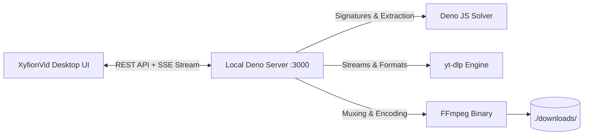

# ⚡ XyfionVid — Ultra HD Video Downloader & Converter

<div align="center">


**A high-performance, privacy-first desktop application to download 4K/1080p web videos and extract 320kbps audio from 1000+ supported media websites.**

[Features](#-key-features) • [Installation](#-quick-start) • [Architecture](#-architecture) • [Keyboard Shortcuts](#-keyboard-shortcuts)

</div>

---

## ✨ Key Features

- **🎬 Ultra HD & Multi-Format Video Downloads:** Download up to 4K (2160p), 2K (1440p), 1080p Full HD at 60fps in MP4, MKV, and WebM with automatic lossless FFmpeg muxing.
- **🎵 Studio Audio Extraction:** One-click conversion to MP3 (320 kbps), ultra-fast original M4A/AAC, audiophile FLAC, raw WAV, and OPUS.
- **🛡️ Built-in Anti-Bot Protection:** Automatic Deno JS-runtime challenge solving and browser session integration to navigate modern website bot protections.
- **⚡ Live Real-Time Telemetry:** Instant Server-Sent Events (SSE) streaming progress, download speed (MB/s), ETA timer, and byte counters.
- **🔄 Local Media Converter & GIF Maker:** Drag-and-drop any video/audio file (MKV, AVI, MOV, WebM, FLAC) to convert, resize, compress, or generate animated GIFs.
- **📦 Batch Queue:** Paste multiple links at once for uninterrupted sequential downloads.
- **📂 One-Click Explorer & Playback:** Reveal files directly in Windows Explorer or play them in your default media player with zero path-escaping bugs.
- **🔒 100% Local & Private:** Zero third-party web tracking, zero cloud proxying. All downloads stay exclusively on your local machine and are ignored by `.gitignore`.

---

## 🚀 Quick Start

### 1. Requirements
- Windows 10 or Windows 11
- [yt-dlp](https://github.com/yt-dlp/yt-dlp), [FFmpeg](https://ffmpeg.org/), and [Deno](https://deno.com/) *(automatically detected from WinGet or system PATH)*

### 2. Launching XyfionVid
Double-click **`Start.bat`** (or `XyfionVid.lnk` on your Desktop).

The background server will initialize, and XyfionVid will automatically open in a native desktop window:
```text
🌐 Web UI: http://localhost:3000
📁 Downloads: .\downloads
⚡ yt-dlp: Enabled (Nightly)
🎬 FFmpeg: Enabled
🦕 Deno: Enabled (JS Solver)
🍪 Browser Auth: Enabled
```

---

## 🛠️ Architecture

XyfionVid is architected for zero-bloat performance:



---

## ⌨️ Shortcuts & Tips

| Action | Shortcut |
| :--- | :--- |
| **Instant Paste & Inspect** | Click `Paste` (`Yapıştır`) button |
| **Quick Download** | Press `Enter` in the URL field |
| **Open Library** | Click `Downloads & Library` tab |
| **Reveal in Folder** | Click `Show in Folder` on any file |
| **Play File** | Click `▶ Play` on any file |

---

## 📄 License
This project is open-source under the [MIT License](LICENSE).

---

## ⚖️ Legal Disclaimer / Yasal Sorumluluk Reddi

### 🇬🇧 English
> **Disclaimer:** XyfionVid is an open-source software suite developed strictly for educational, research, and personal media archiving (fair use) purposes.
> - This software does **not** bypass digital rights management (DRM) protections.
> - The developers and contributors do **not** host, store, stream, or distribute any copyrighted media files.
> - Users are solely responsible for ensuring that their download and conversion activities comply with applicable local laws, intellectual property rights, and the terms of service of the respective platforms.
> - The authors and maintainers assume no liability for misuse, copyright infringement, or unauthorized distribution of third-party content.

### 🇹🇷 Türkçe
> **Yasal Sorumluluk Reddi:** XyfionVid, yalnızca eğitim, araştırma ve kişisel medya arşivleme (adil kullanım / fair use) amacıyla geliştirilmiş açık kaynaklı bir yardımcı yazılımdır.
> - Bu yazılım dijital hak yönetimi (DRM) veya şifreli kopya koruma sistemlerini **aşmaz**.
> - Geliştiriciler hiçbir telifli medya içeriğini barındırmaz, sunmaz veya dağıtmaz.
> - Yazılımın kullanımı sırasında yerel telif hakkı yasalarına, fikri mülkiyet haklarına ve ilgili platformların kullanım şartlarına uyulması tamamen son kullanıcının sorumluluğundadır.
> - Bu yazılımın hukuka aykırı şekilde veya telif haklarını ihlal edecek biçimde kullanılmasından geliştiriciler sorumlu tutulamaz.
